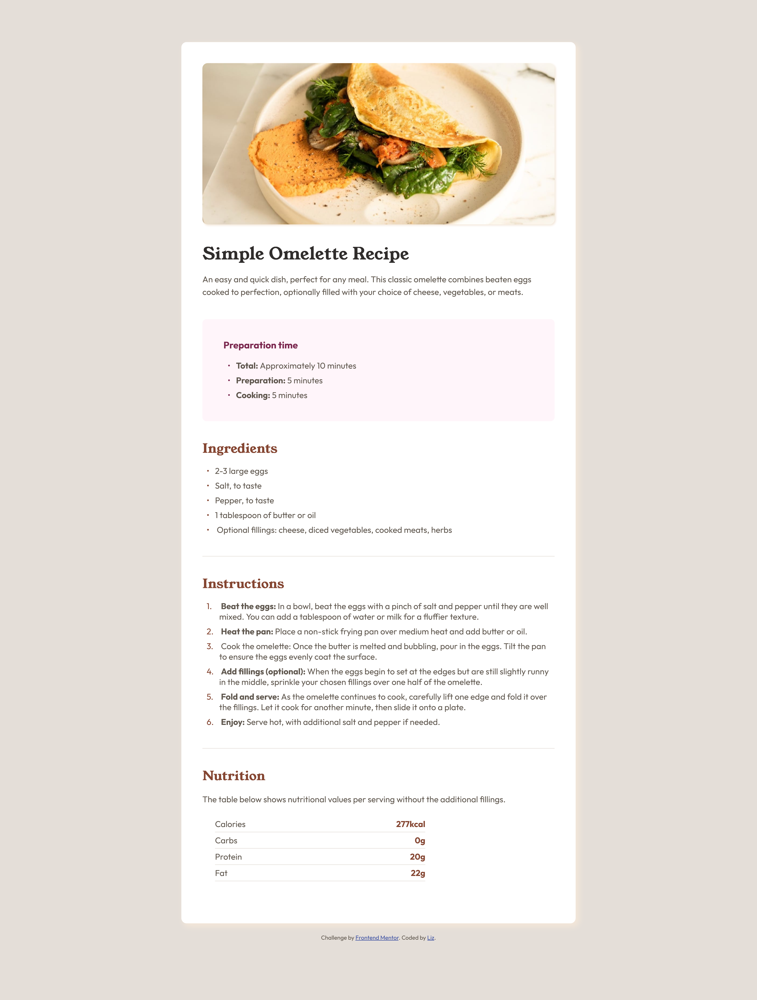
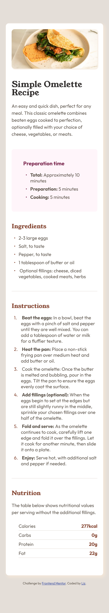

# recipe-page-main

# Frontend Mentor - Recipe page solution

This is a solution to the [Recipe page challenge on Frontend Mentor](https://www.frontendmentor.io/challenges/recipe-page-KiTsR8QQKm). Frontend Mentor challenges help you improve your coding skills by building realistic projects.

## Table of contents

- [Overview](#overview)
  - [The challenge](#the-challenge)
  - [Screenshot](#screenshot)
  - [Links](#links)
- [My process](#my-process)
  - [Built with](#built-with)
  - [What I learned](#what-i-learned)
  - [Continued development](#continued-development)
  - [Useful resources](#useful-resources)
- [Author](#author)

## Overview

### Screenshot

### Links

- Solution URL: [Add solution URL here](https://www.frontendmentor.io/solutions/responsive-recipe-landing-page-tbaL_U-rRp)
- Live Site URL: [Add live site URL here](https://stunning-torrone-d98744.netlify.app/)

## My process

### Built with

- Semantic HTML5 markup
- CSS custom properties
- CSS Grid
- Mobile-first workflow

### What I learned

This exercise not only improved my coding skills but also sharpened my eye for design details and enhanced my ability to translate visual concepts into functional web pages.

### Continued development

Recreating a design from visual reference is kinda challenging. I only guess the spacing between element and font-size required but I am hoping that I will learn also about designing on figma. Overall, I really need to learn more about everything.

### Useful resources

- [Example resource 1](https://developer.mozilla.org/en-US/) - I checked this platform to learn about pseudo-classes and pseudo-elements.

## Author

- Website - [Add your name here](https://www.your-site.com)
- Frontend Mentor - [@yourusername](https://www.frontendmentor.io/profile/Coder-Liz)
